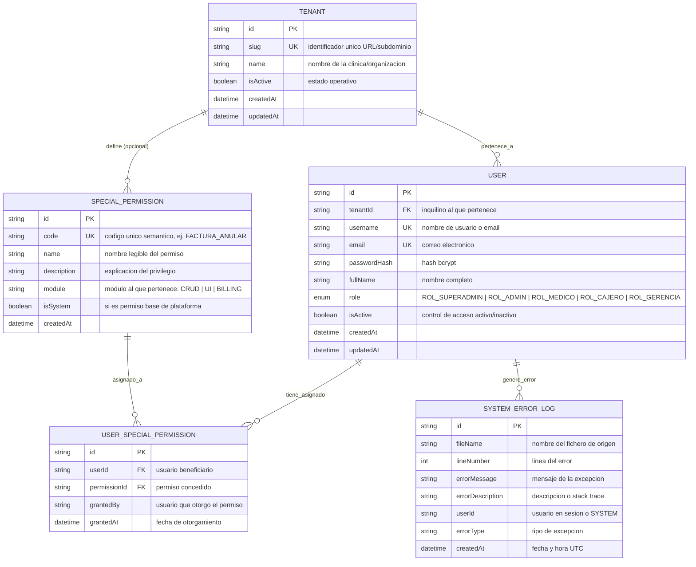

# Data Model: Gestión de Usuarios, Roles, Permisos Especiales y Multi-Tenancy

**Feature**: [spec.md](./spec.md) | **Directory**: `specs/001-user-management-auth` | **Date**: 2026-09-20

---

## 1. Diagrama Entidad-Relación Conceptual



---

## 2. Definición Detallada de Entidades y Restricciones

### 2.1. Entidad `Tenant` (Organización / Clínica)
- **Propósito**: Raíz de aislamiento para la arquitectura Multi-Tenant nativa.
- **Campos**:
  - `id`: `String` (UUID v4), Clave primaria.
  - `slug`: `String` (Único, no nulo, normalizado a minúsculas, ej: `clinica-central`).
  - `name`: `String` (No nulo, ej: "Clínica Médica Santa Fe").
  - `isActive`: `Boolean` (Por defecto: `true`).
  - `createdAt`: `DateTime` (Por defecto: `now()`).
  - `updatedAt`: `DateTime` (Actualización automática).
- **Reglas de Validación**:
  - El `slug` solo puede contener caracteres alfanuméricos y guiones.
  - El inquilino con slug `system` o `master` queda reservado para la superadministración de plataforma.

---

### 2.2. Entidad `User` (Usuario del Sistema)
- **Propósito**: Operador o profesional médico con credenciales de acceso al sistema.
- **Campos**:
  - `id`: `String` (UUID v4), Clave primaria.
  - `tenantId`: `String` (Clave foránea hacia `Tenant.id`, indexado).
  - `username`: `String` (Único por inquilino o global en el caso de superadmin).
  - `email`: `String` (Único en el sistema, formato de correo válido).
  - `passwordHash`: `String` (Hash criptográfico no reversible).
  - `fullName`: `String` (Nombre y apellido del usuario).
  - `role`: Enum `UserRole`:
    - `ROL_SUPERADMIN`
    - `ROL_ADMIN`
    - `ROL_MEDICO`
    - `ROL_CAJERO`
    - `ROL_GERENCIA`
  - `isActive`: `Boolean` (Por defecto: `true`).
  - `createdAt`: `DateTime`.
  - `updatedAt`: `DateTime`.
- **Reglas de Integridad**:
  - No se permite eliminar físicamente al usuario si tiene registros asociados en el sistema clínico (baja lógica mediante `isActive = false`).
  - Se prohíbe la desactivación del único usuario activo con `ROL_SUPERADMIN`.

---

### 2.3. Entidad `SpecialPermission` (Catálogo de Permisos Especiales)
- **Propósito**: Privilegios atómicos y específicos para acciones de CRUD o de frontend.
- **Campos**:
  - `id`: `String` (UUID v4), Clave primaria.
  - `code`: `String` (Único, mayúsculas con guiones bajos, ej. `FACTURA_ANULAR`, `REPORTE_GERENCIAL_EXPORTAR`, `HISTORIA_CLINICA_ELIMINAR`).
  - `name`: `String` (Nombre descriptivo, ej. "Anulación de Facturas").
  - `description`: `String` (Explicación de la capacidad otorgada).
  - `module`: `String` (Módulo de aplicación: `FACTURACION`, `USUARIOS`, `CITAS`, `UI_BUTTONS`).
  - `isSystem`: `Boolean` (Indica si es un permiso intrínseco del núcleo).
  - `createdAt`: `DateTime`.
- **Reglas**:
  - El código de permiso es inmutable una vez creado para asegurar consistencia en código cliente.

---

### 2.4. Entidad `UserSpecialPermission` (Asignación Atómica de Permiso)
- **Propósito**: Tabla intermedia de asociación muchos a muchos entre un usuario y un permiso especial.
- **Campos**:
  - `id`: `String` (UUID v4), Clave primaria.
  - `userId`: `String` (Clave foránea hacia `User.id`, onDelete: Cascade).
  - `permissionId`: `String` (Clave foránea hacia `SpecialPermission.id`, onDelete: Restrict).
  - `grantedBy`: `String` (ID del usuario administrador que otorgó el permiso).
  - `grantedAt`: `DateTime` (Fecha del otorgamiento).
- **Restricción de Unicidad**:
  - Clave compuesta única `@@unique([userId, permissionId])` para evitar duplicación de un mismo permiso a un usuario.

---

### 2.5. Entidad `SystemErrorLog` (Auditoría y Trazabilidad en Base de Datos)
- **Propósito**: Persistencia obligatoria de fallos y excepciones conforme a la Constitución 1.4.
- **Campos**:
  - `id`: `String` (UUID v4), Clave primaria.
  - `fileName`: `String` (Nombre/ruta del fichero donde se originó el error).
  - `lineNumber`: `Int` (Número de línea del error).
  - `errorMessage`: `String` (Mensaje técnico de la excepción).
  - `errorDescription`: `String` (Texto ampliado, stack trace o parámetros).
  - `userId`: `String` (Identificador del usuario en contexto o `'ANONYMOUS'` / `'SYSTEM'`).
  - `errorType`: `String` (Clase o tipo de excepción, ej. `HttpException`, `PrismaKnownError`).
  - `createdAt`: `DateTime` (Timestamp UTC).

---

## 3. Matriz de Roles Base vs Permisos Implícitos

| Rol Base | Alcance Principal | Permisos Implícitos | Puede recibir Permisos Especiales |
|---|---|---|---|
| **`ROL_SUPERADMIN`** | Plataforma Global / Todos los inquilinos | Control absoluto del sistema, creación de tenants, auditoría total. | No requiere (posee acceso total). |
| **`ROL_ADMIN`** | Administración de una clínica (`tenant`) | Gestión de usuarios de su clínica, asignación de permisos, catálogos locales. | Sí |
| **`ROL_MEDICO`** | Módulo de salud y atención | Gestión de citas asignadas, consulta y edición de historias clínicas. | Sí (ej. exportar registros médicos) |
| **`ROL_CAJERO`** | Facturación y pagos | Emisión de comprobantes, cobro de citas, registro de transacciones. | Sí (ej. `FACTURA_ANULAR`) |
| **`ROL_GERENCIA`** | Análisis y supervisión | Visualización de paneles de control, reportes de recaudación y auditoría de citas. | Sí (ej. descarga masiva de balances) |

---

## 4. Algoritmo de Verificación de Permiso (`hasPermission`)

```text
Entrada: userId (string), permissionCode (string)
Salida: boolean (true | false)

1. Obtener el usuario 'u' por userId. Si 'u' no existe o !u.isActive -> Retornar FALSE.
2. Si u.role == 'ROL_SUPERADMIN' -> Retornar TRUE (superadministrador tiene todos los permisos).
3. Si el rol 'u.role' incluye 'permissionCode' en su conjunto de permisos inherentes -> Retornar TRUE.
4. Consultar 'UserSpecialPermission' donde userId == u.id y permission.code == permissionCode.
   - Si existe registro -> Retornar TRUE.
5. En cualquier otro caso -> Retornar FALSE.
```
