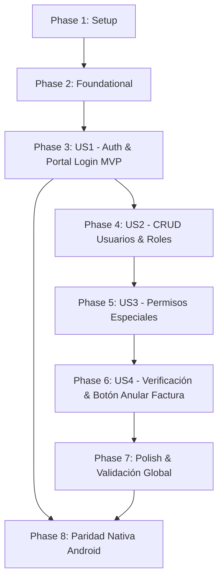

# Tasks: Administración de Usuarios, Roles, Permisos Especiales y Autenticación Multi-Tenant

**Feature**: [spec.md](./spec.md) | **Plan**: [plan.md](./plan.md) | **Date**: 2026-09-20

---

## Phase 1: Setup (Shared Infrastructure)

**Purpose**: Inicialización y configuración de tipos compartidos y dependencias base del monorepo.

- [X] T001 [P] Definir tipos, enums de roles (`ROL_SUPERADMIN`, `ROL_ADMIN`, `ROL_MEDICO`, `ROL_CAJERO`, `ROL_GERENCIA`), interfaces `Tenant`, `SpecialPermission`, `UserSpecialPermission`, `SystemErrorLog` y DTOs en `packages/types/src/index.ts`
- [X] T002 [P] Compilar y verificar el paquete de tipos compartidos `@mmedic/types` en `packages/types/package.json`
- [X] T003 Instalar dependencias de autenticación (`@nestjs/jwt`, `@nestjs/passport`, `passport`, `passport-jwt`, `bcryptjs`, `@types/passport-jwt`, `@types/bcryptjs`) en `apps/api/package.json`

---

## Phase 2: Foundational (Blocking Prerequisites)

**Purpose**: Infraestructura de persistencia, multi-tenancy, trazabilidad de errores en base de datos y esquema relacional en Supabase / PostgreSQL.

> **CRITICAL**: Ninguna tarea de historias de usuario puede comenzar hasta completar esta fase.

- [X] T004 Actualizar el esquema de Prisma con los modelos `Tenant`, `User`, `SpecialPermission`, `UserSpecialPermission` y `SystemErrorLog` (con soporte de `directUrl = env("DIRECT_URL")`) en `apps/api/prisma/schema.prisma`
- [X] T005 Generar y aplicar la migración atómica versionada de Prisma para crear las tablas en la base de datos PostgreSQL de Supabase en `apps/api/prisma/migrations/`
- [X] T006 Implementar el script de semillas reproducibles (`seed.ts`) que cree el tenant inicial `default-clinic`, los permisos especiales base y el usuario `superadmin` con clave cifrada `superadmin@123#` en `apps/api/prisma/seed.ts`
- [X] T007 Implementar el filtro global de excepciones `GlobalExceptionFilter` para persistencia obligatoria de trazas en BD (`SystemErrorLog`: fichero, línea, mensaje, descripción, usuario, fecha y tipo) en `apps/api/src/common/filters/global-exception.filter.ts`
- [X] T008 [P] Implementar el interceptor y contexto de resolución de inquilino `TenantInterceptor` para aislamiento Multi-Tenant por defecto en `apps/api/src/common/interceptors/tenant.interceptor.ts`
- [X] T009 Registrar el filtro global de excepciones y el interceptor de multi-tenancy en el arranque de la API en `apps/api/src/main.ts` y `apps/api/src/app.module.ts`

**Checkpoint**: Base de datos, multi-tenancy, trazabilidad de errores y contratos fundamentales listos.

---

## Phase 3: User Story 1 - Autenticación de Acceso y Portal de Inicio (Priority: P1) 🎯 MVP

**Goal**: Proveer el portal de acceso público con cabecera horizontal informativa, login con layout responsivo (80% identidad visual / 20% formulario en escritorio, apilado en móvil) y autenticación segura con la cuenta `superadmin`.

**Independent Test**: Iniciar sesión con el usuario `superadmin` y contraseña `superadmin@123#`, validando la generación de token JWT, la cabecera horizontal con los enlaces "Acerca de", "Contáctanos", "Quiénes somos" y el comportamiento responsivo del layout sin desbordamiento horizontal.

### Implementation for User Story 1

- [X] T010 [P] [US1] Implementar la estrategia de validación JWT `JwtStrategy` y el guard `JwtAuthGuard` en `apps/api/src/modules/auth/jwt.strategy.ts`
- [X] T011 [US1] Implementar el servicio de autenticación `AuthService` para validación de credenciales con bcrypt y generación de tokens JWT en `apps/api/src/modules/auth/auth.service.ts`
- [X] T012 [US1] Implementar el controlador delgado de autenticación `AuthController` (`POST /api/v1/auth/login`, `GET /api/v1/auth/me`, $\le$ 80 LOC) en `apps/api/src/modules/auth/auth.controller.ts`
- [X] T013 [US1] Configurar y exportar el módulo `AuthModule` integrándolo en `apps/api/src/app.module.ts`
- [X] T014 [P] [US1] Implementar el servicio de cliente `AuthService` en Angular con estado reactivo basado en Signals (`currentUser`, `token`, `isAuthenticated`) en `apps/web/src/app/services/auth.service.ts`
- [X] T015 [P] [US1] Implementar el componente de cabecera horizontal `HeaderComponent` con `logo.svg` alineado a la izquierda y menú a la derecha ("Acerca de", "Contáctanos", "Quiénes somos") en `apps/web/src/app/components/header/header.component.ts`
- [X] T016 [US1] Implementar la plantilla HTML y estilos CSS accesibles del `HeaderComponent` en `apps/web/src/app/components/header/header.component.html` y `header.component.css`
- [X] T017 [US1] Implementar el componente `LoginComponent` con formulario reactivo, validaciones y conexión con `AuthService` en `apps/web/src/app/components/login/login.component.ts`
- [X] T018 [US1] Diseñar la plantilla y estilos del `LoginComponent` aplicando layout dividido 80% (branding/logo) y 20% (formulario) en escritorio, con reorganización fluida Mobile-First en pantallas móviles en `apps/web/src/app/components/login/login.component.html` y `login.component.css`
- [X] T019 [US1] Configurar el enrutamiento de la aplicación Angular (`/login`, `/dashboard`) y guardias de ruta en `apps/web/src/app/app.routes.ts`

**Checkpoint**: User Story 1 (MVP) completamente funcional e independientemente verificable.

---

## Phase 4: User Story 2 - Gestión y Administración de Usuarios con Roles Base (Priority: P2)

**Goal**: Permitir el CRUD completo de usuarios asignándoles los roles base del sistema (`ROL_SUPERADMIN`, `ROL_ADMIN`, `ROL_MEDICO`, `ROL_CAJERO`, `ROL_GERENCIA`) bajo estricto aislamiento multi-tenant.

**Independent Test**: Crear un usuario con rol `ROL_MEDICO` y otro con `ROL_CAJERO`, listar los usuarios del inquilino, editar sus datos y validar que no puedan verse usuarios de otros inquilinos.

### Implementation for User Story 2

- [X] T020 [P] [US2] Crear los DTOs de validación `CreateUserDto` y `UpdateUserDto` con `class-validator` en `apps/api/src/modules/users/dto/create-user.dto.ts`
- [X] T021 [US2] Implementar el servicio `UsersService` con métodos de listado paginado, creación con hashing de clave, edición y desactivación lógica en `apps/api/src/modules/users/users.service.ts`
- [X] T022 [US2] Implementar el controlador delgado `UsersController` (`GET /api/v1/users`, `POST /api/v1/users`, `PUT /api/v1/users/:id`, `PATCH /api/v1/users/:id/status`, $\le$ 80 LOC) en `apps/api/src/modules/users/users.controller.ts`
- [X] T023 [US2] Configurar y exportar el módulo `UsersModule` integrándolo en `apps/api/src/app.module.ts`
- [X] T024 [P] [US2] Implementar el servicio frontend `UsersService` para consumo de endpoints de usuarios en `apps/web/src/app/services/users.service.ts`
- [X] T025 [US2] Implementar el componente de lista y gestión de usuarios `UsersListComponent` en `apps/web/src/app/components/users/users-list.component.ts`
- [X] T026 [US2] Implementar la plantilla HTML y estilos adaptativos (tabla responsiva / cards en móvil) para `UsersListComponent` en `apps/web/src/app/components/users/users-list.component.html` y `users-list.component.css`
- [X] T027 [US2] Implementar el diálogo modal o formulario de alta y edición de usuarios con selector de roles en `apps/web/src/app/components/users/user-form-modal.component.ts`

**Checkpoint**: User Stories 1 y 2 funcionando e integradas armónicamente.

---

## Phase 5: User Story 3 - Asignación Dinámica de Permisos Especiales (Priority: P3)

**Goal**: Permitir la definición en catálogo y la asignación o revocación de permisos especiales atómicos a nivel individual de usuario.

**Independent Test**: Asignar el permiso especial `FACTURA_ANULAR` a un usuario con rol `ROL_CAJERO` y verificar que quede registrado en su perfil y en la tabla relacional.

### Implementation for User Story 3

- [X] T028 [P] [US3] Implementar el servicio `PermissionsService` para listar el catálogo de permisos especiales y gestionar la asignación/revocación por usuario en `apps/api/src/modules/permissions/permissions.service.ts`
- [X] T029 [US3] Implementar el controlador delgado `PermissionsController` (`GET /api/v1/permissions`, `POST /api/v1/users/:id/permissions`, `DELETE /api/v1/users/:id/permissions/:code`, $\le$ 80 LOC) en `apps/api/src/modules/permissions/permissions.controller.ts`
- [X] T030 [US3] Configurar y registrar el módulo `PermissionsModule` en `apps/api/src/app.module.ts`
- [X] T031 [P] [US3] Implementar el servicio frontend `PermissionsService` para gestión de permisos en `apps/web/src/app/services/permissions.service.ts`
- [X] T032 [US3] Implementar el componente modal de asignación de permisos especiales por usuario `UserPermissionsModalComponent` en `apps/web/src/app/components/users/user-permissions-modal.component.ts`
- [X] T033 [US3] Diseñar la plantilla HTML y estilos del modal con badges visuales e interruptores (toggles) de activación/desactivación en `apps/web/src/app/components/users/user-permissions-modal.component.html` y `user-permissions-modal.component.css`

**Checkpoint**: Permisos especiales administrables y persistidos a nivel de usuario.

---

## Phase 6: User Story 4 - Consulta de Verificación Usuario + Permiso y Activación Condicional (Priority: P4)

**Goal**: Proveer el mecanismo de consulta `verificarPermiso(usuario, permiso) -> boolean` que devuelva `verdadero` si existe la combinación, y utilizarlo para habilitar condicionalmente acciones en la interfaz (ej. botón "Anular Factura").

**Independent Test**: Invocar el endpoint de verificación y comprobar en la vista de simulación que el botón "Anular Factura" se habilita exclusivamente cuando el usuario posee el permiso `FACTURA_ANULAR`.

### Implementation for User Story 4

- [X] T034 [US4] Implementar el método de verificación `checkUserPermission(userId, permissionCode)` en `apps/api/src/modules/permissions/permissions.service.ts`
- [X] T035 [US4] Exponer el endpoint público de verificación `POST /api/v1/permissions/check` en `apps/api/src/modules/permissions/permissions.controller.ts`
- [X] T036 [P] [US4] Implementar la función de verificación reactiva en `apps/web/src/app/services/permissions.service.ts`
- [X] T037 [US4] Implementar el componente interactivo de demostración de acciones `InvoiceActionsDemoComponent` con botón dinámico "Anular Factura" condicionado por el permiso en `apps/web/src/app/components/billing-demo/invoice-actions-demo.component.ts`
- [X] T038 [US4] Diseñar la plantilla y estilos del componente de demostración con feedback visual claro del estado del permiso en `apps/web/src/app/components/billing-demo/invoice-actions-demo.component.html` y `invoice-actions-demo.component.css`

**Checkpoint**: Verificación de permisos y activación condicional de controles 100% operativos.

---

## Phase 7: Polish & Cross-Cutting Concerns

**Purpose**: Verificación de calidad de código, compilación limpia del monorepo, adherencia constitucional y validación quickstart.

- [X] T039 [P] Verificar que todos los controladores no excedan las 80 LOC y que componentes/servicios no superen las 300 LOC conforme a la Constitución 3.2 y 3.3
- [X] T040 Actualizar el archivo `README.md` del monorepo con las credenciales iniciales de acceso y la guía de configuración para Supabase en `README.md`
- [X] T041 Ejecutar la compilación completa del monorepo (`pnpm build`) verificando cero errores en Web, API y Types
- [X] T042 Ejecutar y validar los 6 escenarios de prueba definidos en `specs/001-user-management-auth/quickstart.md`

---

## Phase 8: Android Native Parity (Jetpack Compose & Kotlin)

**Purpose**: Implementación de la paridad nativa Android para autenticación y consulta de sesión conforme al Principio 1.3 de la Constitución v2.5.0.

- [ ] T043 [P] Definir modelos de datos de autenticación (`LoginRequest`, `LoginResponse`, `User`, `ApiResponse<T>`) en `apps/android/app/src/main/java/com/mmedic/data/model/AuthModels.kt`
- [ ] T044 Implementar `AuthApiService` y gestor seguro de sesión JWT (`SessionManager`) en `apps/android/app/src/main/java/com/mmedic/data/api/`
- [ ] T045 Implementar `AuthViewModel` con StateFlow para estados de login y verificación de permisos (`hasPermission`) en `apps/android/app/src/main/java/com/mmedic/ui/auth/AuthViewModel.kt`
- [ ] T046 Diseñar pantalla nativa `LoginScreen` en Jetpack Compose con branding MMedic, soporte de errores y tokens de diseño en `apps/android/app/src/main/java/com/mmedic/ui/auth/LoginScreen.kt`
- [ ] T047 Integrar flujo de autenticación y navegación condicional en `apps/android/app/src/main/java/com/mmedic/MainActivity.kt`

---

## Dependencies & Execution Order

### Phase Dependencies

---

## Final Verification Checklist

- [X] **Compilación Limpia**: `pnpm build` finalizado con código 0 en `@mmedic/types`, `api` y `web`.
- [X] **Límites Constitucionales**: Todos los controladores $\le$ 80 LOC, componentes $\le$ 300 LOC.
- [X] **Trazabilidad en BD**: Errores en backend registrados en `system_error_logs`.
- [X] **Multi-Tenancy por Defecto**: Inquilinos aislados vía `tenantId` e interceptores globales.
- [X] **Mobile-First**: Vistas adaptativas en móvil (< 640px) y escritorio (80/20 split en login).
- [X] **Credencial Root**: Usuario `superadmin` con clave `superadmin@123#` sembrado y funcional.
