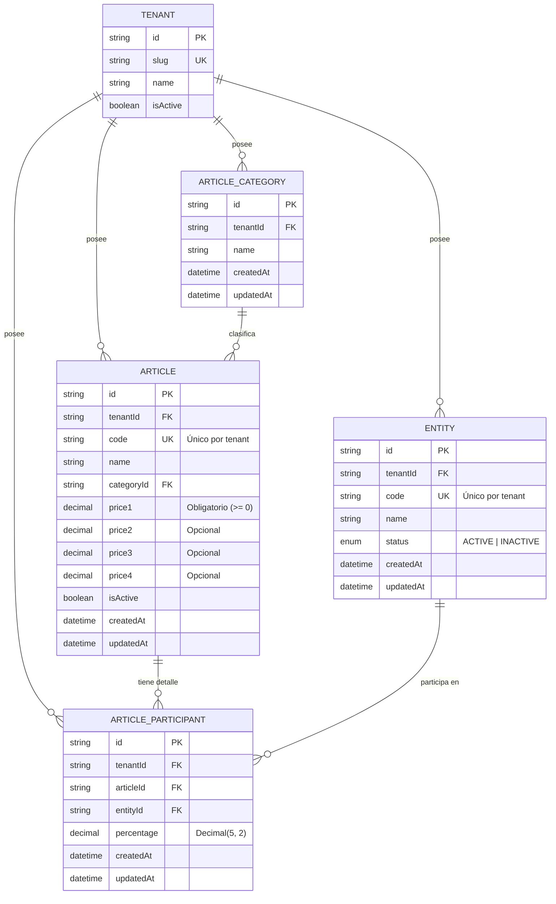

# Data Model: Registro y Gestión de Artículos, Categorías y Entidades Participantes

**Feature Branch**: `002-article-product-management`  
**Date**: 2026-09-22  
**Status**: Completed  
**Spec Reference**: [specs/002-article-product-management/spec.md](./spec.md)

---

## 1. Diagrama Entidad-Relación (Mermaid)



---

## 2. Definición de Entidades y Modelos Prisma

### 2.1. Enum `EntityStatus`

```prisma
enum EntityStatus {
  ACTIVE
  INACTIVE
}
```

### 2.2. Modelo `ArticleCategory` (`article_categories`)

Representa la agrupación temática de los productos o servicios médicos facturables.

```prisma
model ArticleCategory {
  id        String   @id @default(uuid())
  tenantId  String
  tenant    Tenant   @relation(fields: [tenantId], references: [id], onDelete: Cascade)
  name      String
  createdAt DateTime @default(now())
  updatedAt DateTime @updatedAt

  articles Article[]

  @@unique([tenantId, name])
  @@index([tenantId])
  @@map("article_categories")
}
```

- **Reglas de Integridad**:
  - `@@unique([tenantId, name])`: No pueden existir dos categorías con el mismo nombre dentro de la misma organización.
  - **Inmutabilidad**: No se implementa acción de borrado (`DELETE`). `onDelete: Restrict` en los artículos previene eliminación por base de datos si existen referencias.

---

### 2.3. Modelo `Entity` (`entities`)

Representa a las entidades maestras o participantes (médicos, especialistas, laboratorios, clínicas asociadas, prestadores externos) que participan en la ejecución y liquidación de un artículo.

```prisma
model Entity {
  id        String       @id @default(uuid())
  tenantId  String
  tenant    Tenant       @relation(fields: [tenantId], references: [id], onDelete: Cascade)
  code      String
  name      String
  status    EntityStatus @default(ACTIVE)
  createdAt DateTime     @default(now())
  updatedAt DateTime     @updatedAt

  articleParticipants ArticleParticipant[]

  @@unique([tenantId, code])
  @@index([tenantId])
  @@index([tenantId, code])
  @@map("entities")
}
```

- **Reglas de Integridad**:
  - `code`: Clave de búsqueda operativa única por tenant (ej. "MED-001", "LAB-SUR").
  - `status`: Controla si la entidad se encuentra habilitada para ser asignada a nuevos artículos.

---

### 2.4. Modelo `Article` (`articles`)

Representa el artículo o producto que podrá ser facturado a los pacientes.

```prisma
model Article {
  id         String          @id @default(uuid())
  tenantId   String
  tenant     Tenant          @relation(fields: [tenantId], references: [id], onDelete: Cascade)
  code       String
  name       String
  categoryId String
  category   ArticleCategory @relation(fields: [categoryId], references: [id], onDelete: Restrict)
  
  price1     Decimal         @db.Decimal(12, 2)
  price2     Decimal?        @db.Decimal(12, 2)
  price3     Decimal?        @db.Decimal(12, 2)
  price4     Decimal?        @db.Decimal(12, 2)

  isActive   Boolean         @default(true)
  createdAt  DateTime        @default(now())
  updatedAt  DateTime        @updatedAt

  participants ArticleParticipant[]

  @@unique([tenantId, code])
  @@index([tenantId])
  @@index([categoryId])
  @@map("articles")
}
```

- **Reglas de Integridad**:
  - `code`: Único por tenant.
  - `price1`: Obligatorio, valor $\ge 0$.
  - `price2`, `price3`, `price4`: Opcionales, valores $\ge 0$ si están presentes.
  - `categoryId`: Referencia obligatoria a una categoría activa.

---

### 2.5. Modelo `ArticleParticipant` (`article_participants`)

Tabla intermedia que define la distribución de porcentajes de participación por artículo.

```prisma
model ArticleParticipant {
  id         String   @id @default(uuid())
  tenantId   String
  tenant     Tenant   @relation(fields: [tenantId], references: [id], onDelete: Cascade)
  articleId  String
  article    Article  @relation(fields: [articleId], references: [id], onDelete: Cascade)
  entityId   String
  entity     Entity   @relation(fields: [entityId], references: [id], onDelete: Restrict)
  percentage Decimal  @db.Decimal(5, 2)
  createdAt  DateTime @default(now())
  updatedAt  DateTime @updatedAt

  @@unique([articleId, entityId])
  @@index([tenantId])
  @@index([articleId])
  @@index([entityId])
  @@map("article_participants")
}
```

- **Reglas de Integridad**:
  - `@@unique([articleId, entityId])`: Un participante no puede asociarse dos veces al mismo artículo.
  - `percentage`: Tipo `Decimal(5, 2)` (valores de 0.01 a 100.00).
  - **Invariante de Dominio**: $\sum_{i=1}^{N} \text{percentage}_i \le 100.00\%$. Si la suma excede 100.00, la transacción se aborta con error de validación.

---

## 3. Matriz de Validaciones de Datos

| Campo | Entidad | Tipo | Reglas de Validación |
|---|---|---|---|
| `code` | `Article` | `String` | Obligatorio, trim, no vacío, longitud 1-50 caracteres, único por `tenantId`. |
| `name` | `Article` | `String` | Obligatorio, trim, no vacío, longitud 2-150 caracteres. |
| `categoryId` | `Article` | `UUID` | Obligatorio, debe existir y pertenecer al mismo `tenantId`. |
| `price1` | `Article` | `Decimal` | Obligatorio, numérico, $\ge 0.00$. |
| `price2..4` | `Article` | `Decimal?` | Opcional, si se suministra debe ser numérico y $\ge 0.00$. |
| `name` | `ArticleCategory`| `String` | Obligatorio, trim, no vacío, longitud 2-100 caracteres, único por `tenantId`. |
| `code` | `Entity` | `String` | Obligatorio, trim, no vacío, longitud 1-50 caracteres, único por `tenantId`. |
| `name` | `Entity` | `String` | Obligatorio, trim, no vacío, longitud 2-150 caracteres. |
| `status` | `Entity` | `Enum` | Valores permitidos: `'ACTIVE'`, `'INACTIVE'`. Por defecto: `'ACTIVE'`. |
| `percentage` | `ArticleParticipant` | `Decimal` | Obligatorio, numérico, $> 0.00$ y $\le 100.00$, máx 2 decimales. |
| $\sum \text{percentage}$ | `Article` | `Decimal` | Acumulado de todas las filas del artículo $\le 100.00$. |

---

## 4. Transiciones de Estado

### 4.1. Entidad (`Entity`)
```
[NUEVA] -> ACTIVE <---> INACTIVE
```
- Una entidad nace como `ACTIVE` (por defecto en el modal o API).
- Puede pasar a `INACTIVE` si el prestador cesa actividades.
- Si está `INACTIVE`, la UI de artículos emite una advertencia visual al seleccionarla.

### 4.2. Artículo (`Article`)
```
[BORRADOR EN UI] -> VALIDACIÓN (% <= 100) -> ACTIVO (PERSISTIDO) <---> INACTIVO
```
- El artículo y sus filas de participantes se insertan atómicamente en una única transacción de Prisma (`$transaction`).
- La edición de participantes reemplaza las filas de participación recalculando la suma acumulada de forma atómica.
