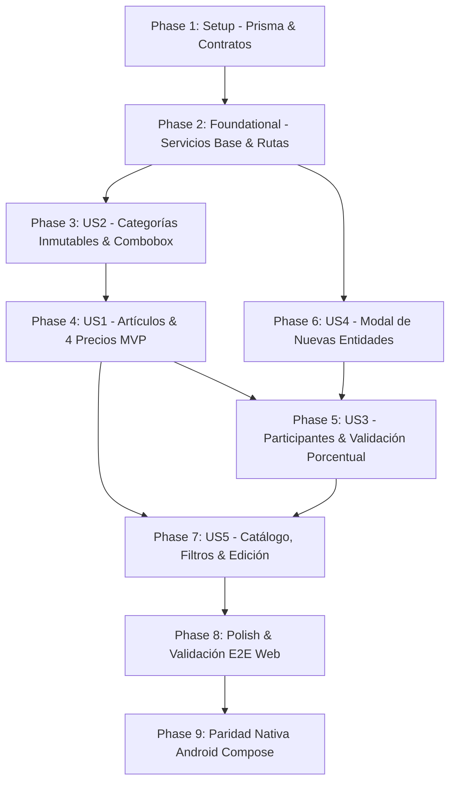

# Implementation Tasks: Registro y Gestión de Artículos, Categorías y Entidades Participantes

**Feature**: `002-article-product-management`  
**Branch**: `002-article-product-management`  
**Spec Reference**: [specs/002-article-product-management/spec.md](./spec.md) | [plan.md](./plan.md) | [data-model.md](./data-model.md) | [contracts/api-contracts.md](./contracts/api-contracts.md)

---

## Phase 1: Setup (Shared Infrastructure)

**Purpose**: Definición de contratos compartidos en `@mmedic/types`, actualización del esquema de Prisma ORM y migración atómica de base de datos.

- [X] T001 Definir contratos e interfaces de `ArticleCategory`, `Entity`, `Article`, `ArticleParticipant`, enums `EntityStatus` y DTOs en packages/types/src/index.ts
- [X] T002 Actualizar el esquema de base de datos con los modelos `ArticleCategory`, `Entity`, `Article`, `ArticleParticipant` y enum `EntityStatus` en apps/api/prisma/schema.prisma
- [X] T003 Ejecutar migración atómica de base de datos con Prisma y regenerar cliente con `pnpm --filter api exec prisma migrate dev --name add_articles_categories_entities` y `pnpm db:generate`

---

## Phase 2: Foundational (Blocking Prerequisites)

**Purpose**: Estructura base de servicios, inyección de contexto multi-tenant y configuración de rutas en backend y frontend.

> **CRITICAL**: Esta fase debe completarse antes de iniciar la implementación de historias de usuario.

- [X] T004 Crear `CategoriesService` con aislamiento multi-tenant por `tenantId` en apps/api/src/modules/categories/categories.service.ts
- [X] T005 [P] Crear `EntitiesService` con búsqueda por código y aislamiento por `tenantId` en apps/api/src/modules/entities/entities.service.ts
- [X] T006 [P] Crear `ArticlesService` con lógica transaccional y validación de suma de porcentajes $\le 100.00\%$ en apps/api/src/modules/articles/articles.service.ts
- [X] T007 [P] Implementar servicios Angular basados en Signals (`CategoriesService`, `EntitiesService`, `ArticlesService`) para consumo de endpoints con `ApiResponse<T>` en apps/web/src/app/services/
- [X] T008 Configurar rutas del módulo de artículos con `AuthGuard` en apps/web/src/app/app.routes.ts

---

## Phase 3: User Story 2 - Selección y Creación Rápida de Categorías Inmutables (Priority: P1)

**Goal**: Permitir seleccionar categorías de artículos desde una lista desplegable con búsqueda en tiempo real, agregando nuevas categorías en línea sin recargar la pantalla y garantizando su inmutabilidad (sin opción de borrado).

**Independent Test**: Abrir el selector de categorías, buscar un término, crear una nueva categoría pulsando "+ Crear [categoría]", verificar persistencia inmediata en backend y comprobar que no existe endpoint ni botón de eliminación.

- [X] T009 [US2] Implementar `CategoriesController` (GET `/api/categories`, POST `/api/categories`, sin DELETE, $\le 80$ LOC) y `CreateCategoryDto` en apps/api/src/modules/categories/categories.controller.ts
- [X] T010 [US2] Registrar y configurar `CategoriesModule` en apps/api/src/app.module.ts
- [X] T011 [P] [US2] Implementar componente `CategoryComboboxComponent` con Angular Signals, filtrado reactivo y acción integrada de creación en apps/web/src/app/components/articles/category-combobox/category-combobox.component.ts
- [X] T012 [P] [US2] Crear estilos CSS Mobile-First para `CategoryComboboxComponent` en apps/web/src/app/components/articles/category-combobox/category-combobox.component.css

---

## Phase 4: User Story 1 - Registro y Catálogo de Artículos con Múltiples Precios (Priority: P1) 🎯 MVP

**Goal**: Registrar artículos con código único por tenant, nombre descriptivo, categoría asociada y hasta 4 montos de precios de venta (Precio 1 obligatorio $\ge 0$, Precios 2 a 4 opcionales $\ge 0$).

**Independent Test**: Completar el formulario con código "CONS-001", nombre "Consulta General", categoría válida y 3 montos de precios; guardar y verificar persistencia en base de datos.

- [X] T013 [US1] Implementar validación de datos en `CreateArticleDto` con `@IsNotEmpty`, `@IsNumber`, `@Min(0)` y `@IsOptional` en apps/api/src/modules/articles/dto/create-article.dto.ts
- [X] T014 [US1] Implementar método de creación en `ArticlesService` y controlador delgado `ArticlesController` ($\le 80$ LOC) en apps/api/src/modules/articles/articles.controller.ts
- [X] T015 [US1] Registrar y configurar `ArticlesModule` en apps/api/src/app.module.ts
- [X] T016 [P] [US1] Implementar formulario `ArticleFormComponent` integrando campos de código, nombre, 4 precios y `CategoryComboboxComponent` en apps/web/src/app/components/articles/article-form/article-form.component.ts
- [X] T017 [P] [US1] Crear estilos CSS Mobile-First para `ArticleFormComponent` en apps/web/src/app/components/articles/article-form/article-form.component.css

---

## Phase 5: User Story 3 - Detalle de Participantes con Búsqueda por Código y Distribución Porcentual (Priority: P1)

**Goal**: Asociar múltiples participantes existentes a un artículo mediante la búsqueda de su código único, con porcentaje de participación individual y validación estricta de que la suma acumulada nunca supere el 100.00% ($\sum \% \le 100\%$).

**Independent Test**: Añadir dos participantes existentes a un artículo asignando 40% y 50% (suma 90%, permitido). Luego intentar asignar 20% adicional (suma 110%) y constatar que el frontend bloquea el botón y el backend rechaza con `400 Bad Request`.

- [X] T018 [US3] Implementar endpoint de búsqueda por código `GET /api/entities/by-code/:code` en apps/api/src/modules/entities/entities.controller.ts
- [X] T019 [US3] Implementar guardado transaccional de participantes con validación de no duplicidad de entidad y suma $\le 100.00\%$ en apps/api/src/modules/articles/articles.service.ts
- [X] T020 [P] [US3] Crear componente `ParticipantsTableComponent` con búsqueda por código, input de porcentaje y señal reactiva `computed()` para cálculo de suma en apps/web/src/app/components/articles/participants-table/participants-table.component.ts
- [X] T021 [P] [US3] Implementar estilos CSS Mobile-First para `ParticipantsTableComponent` (tarjetas apiladas en móvil < 640px, tabla en desktop, sin overflow) en apps/web/src/app/components/articles/participants-table/participants-table.component.css
- [X] T022 [US3] Integrar `ParticipantsTableComponent` dentro de `ArticleFormComponent` en apps/web/src/app/components/articles/article-form/article-form.component.ts

---

## Phase 6: User Story 4 - Registro Inmediato de Nuevas Entidades Participantes mediante Modal (Priority: P2)

**Goal**: Abrir una ventana modal desde la tabla detalle de participantes para dar de alta una nueva entidad que no exista previamente (código, nombre, estatus), insertándola de forma inmediata como fila en el detalle tras su creación.

**Independent Test**: Pulsar "+ Nuevo Participante" en el formulario de artículo, llenar el modal con código y nombre de nueva entidad, guardar en el modal y constatar que se persiste en `entities` y se añade automáticamente al detalle del artículo.

- [X] T023 [US4] Implementar `CreateEntityDto` y endpoints (GET `/api/entities`, POST `/api/entities`, $\le 80$ LOC) en apps/api/src/modules/entities/entities.controller.ts
- [X] T024 [US4] Registrar y configurar `EntitiesModule` en apps/api/src/app.module.ts
- [X] T025 [P] [US4] Crear componente modal `EntityModalComponent` con inputs accesibles de código, nombre y estatus en apps/web/src/app/components/articles/entity-modal/entity-modal.component.ts
- [X] T026 [P] [US4] Crear estilos CSS Mobile-First para `EntityModalComponent` con áreas táctiles $\ge 44\times44$px en apps/web/src/app/components/articles/entity-modal/entity-modal.component.css
- [X] T027 [US4] Conectar evento de guardado de `EntityModalComponent` en `ParticipantsTableComponent` para autocompletar e insertar la entidad creada en apps/web/src/app/components/articles/participants-table/participants-table.component.ts

---

## Phase 7: User Story 5 - Consulta y Edición del Catálogo de Artículos y sus Participantes (Priority: P2)

**Goal**: Listar artículos existentes con filtros de búsqueda por texto y categoría, y permitir abrir un artículo existente para actualizar sus datos, precios o lista de participantes.

**Independent Test**: Listar artículos filtrando por categoría, abrir un artículo para edición, modificar el Precio 2 y ajustar un porcentaje de participación, guardar y verificar los cambios.

- [X] T028 [US5] Implementar endpoints `GET /api/articles` (con filtros) y `GET /api/articles/:id` (incluyendo categoría y participantes) en apps/api/src/modules/articles/articles.service.ts
- [X] T029 [US5] Implementar endpoint `PUT /api/articles/:id` con `UpdateArticleDto` para sincronización atómica de artículo y participantes en apps/api/src/modules/articles/articles.service.ts
- [X] T030 [P] [US5] Crear componente `ArticlesListComponent` con buscador, filtro de categoría y tabla/tarjetas responsivas en apps/web/src/app/components/articles/articles-list/articles-list.component.ts
- [X] T031 [P] [US5] Crear estilos CSS Mobile-First para `ArticlesListComponent` en apps/web/src/app/components/articles/articles-list/articles-list.component.css
- [X] T032 [US5] Habilitar modo de edición en `ArticleFormComponent` cargando los datos del artículo existente por parámetro de ruta `:id` en apps/web/src/app/components/articles/article-form/article-form.component.ts

---

## Phase 8: Polish & Cross-Cutting Concerns

**Purpose**: Verificación de calidad, auditoría constitucional y validación end-to-end.

- [X] T033 Auditar límite de líneas: verificar controladores $\le 80$ LOC y archivos $\le 300$ LOC en todos los componentes creados
- [X] T034 [P] Agregar enlace de navegación al módulo de Artículos en el menú horizontal de la cabecera en apps/web/src/app/components/header/header.component.html
- [X] T035 [P] Validar compilación y tipos completos del monorepo mediante `pnpm build`
- [X] T036 Ejecutar y validar escenarios de prueba end-to-end descritos en specs/002-article-product-management/quickstart.md

---

## Phase 9: Android Native Parity (Jetpack Compose & Kotlin)

**Purpose**: Implementar la versión móvil nativa del módulo de Artículos, Categorías y Participantes en Android (`apps/android`) cumpliendo la directiva de Paridad Obligatoria Web-Android (Constitución v2.5.0, Principio 1.3).

- [X] T037 [P] Crear modelos de datos y DTOs Kotlin (`Article`, `ArticleCategory`, `Entity`, `ArticleParticipant`, `CreateArticleDto`, `CreateCategoryDto`, `CreateEntityDto`) en apps/android/app/src/main/java/com/mmedic/data/model/ArticleModels.kt
- [X] T038 Implementar interfaz Retrofit `ArticlesApiService` para consumo de endpoints (`/articles`, `/article-categories`, `/entities`) en apps/android/app/src/main/java/com/mmedic/data/api/ArticlesApiService.kt
- [X] T039 Implementar `ArticlesViewModel` con StateFlow para listado, filtros, creación de artículos y validación reactiva en tiempo real de la suma de porcentajes $\le 100.00\%$ en apps/android/app/src/main/java/com/mmedic/ui/articles/ArticlesViewModel.kt
- [X] T040 [P] Implementar diálogos modales nativos en Jetpack Compose para alta rápida: `CategoryDialog` y `EntityDialog` en apps/android/app/src/main/java/com/mmedic/ui/articles/
- [X] T041 Implementar pantalla de formulario de artículo `ArticleFormScreen` con 4 precios, selector de categoría y detalle de participantes en apps/android/app/src/main/java/com/mmedic/ui/articles/ArticleFormScreen.kt
- [X] T042 Implementar pantalla de catálogo `ArticlesScreen` con `LazyColumn`, barra de búsqueda, chips de categorías y FAB en apps/android/app/src/main/java/com/mmedic/ui/articles/ArticlesScreen.kt
- [X] T043 Integrar navegación del catálogo y formulario en apps/android/app/src/main/java/com/mmedic/MainActivity.kt

---

## Dependencies & Execution Order

### Phase Dependencies

### Oportunidades de Ejecución en Paralelo [P]

- **Phase 1**: T001 y T002 pueden redactarse secuencialmente antes de T003.
- **Phase 2**: T005, T006 y T007 pueden desarrollarse en paralelo una vez completada la estructura base.
- **Phase 3**: T011 (Lógica Combobox) y T012 (Estilos CSS) pueden ejecutarse en paralelo.
- **Phase 4**: T016 (Formulario Artículo) y T017 (Estilos CSS) pueden ejecutarse en paralelo.
- **Phase 5**: T020 (Tabla Participantes) y T021 (Estilos CSS) pueden ejecutarse en paralelo.
- **Phase 6**: T025 (Modal Entidad) y T026 (Estilos CSS) pueden ejecutarse en paralelo.
- **Phase 7**: T030 (Listado Artículos) y T031 (Estilos CSS) pueden ejecutarse en paralelo.
- **Phase 8**: T034 (Header link) y T035 (`pnpm build`) pueden ejecutarse en paralelo.

---

## Estrategia de Implementación

### MVP Inicial (Entrega Temprana)
1. Completar **Fase 1 (Setup)** y **Fase 2 (Foundational)**.
2. Completar **Fase 3 (US2: Categorías)** y **Fase 4 (US1: Artículos y Precios)**.
3. **Validación MVP**: En este punto ya es posible registrar artículos con sus 4 precios y clasificarlos en categorías inmutables.

### Entrega Incremental de Participantes
4. Incorporar **Fase 6 (US4: Entidades y Modal)** y **Fase 5 (US3: Detalle de Participantes con Validación $\le 100\%$)**.
5. **Validación Incremental**: Artículos con honorarios y participantes completamente funcionales.
6. Incorporar **Fase 7 (US5: Catálogo y Edición)** y **Fase 8 (Polish)** para entrega final y auditoría constitucional.
