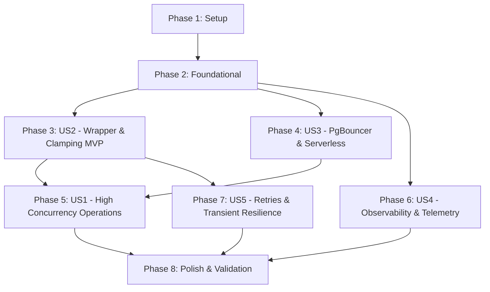

# Tasks: Connection Pooling & Database Resilience for 1000 Concurrent Users

**Feature**: `008-connection-pooling-optimization`  
**Branch**: `008-connection-pooling-optimization`  
**Spec**: [spec.md](file:///specs/008-connection-pooling-optimization/spec.md) | **Plan**: [plan.md](file:///specs/008-connection-pooling-optimization/plan.md)  
**Status**: Ready for Implementation  

---

## Phase 1: Setup (Shared Infrastructure)

**Purpose**: Environment templates and shared type contracts initialization.

- [X] T001 Update environment configuration template with Supabase PgBouncer parameters (`pgbouncer=true`, `connection_limit=10`, `pool_timeout=5`) in `apps/api/.env.example`
- [X] T002 [P] Export pool telemetry response interface `DatabaseHealthResponse` conforming to `health-contract.json` in `packages/types/src/index.ts`

---

## Phase 2: Foundational (Blocking Prerequisites)

**Purpose**: Core configuration parsers, metric accumulators, and error filters that MUST be complete before user story logic can execute.

⚠️ **CRITICAL**: No user story implementation can begin until this foundational phase is complete.

- [X] T003 [P] Implement pool configuration parser and validator `resolvePoolConfig` with defaults (`connectionLimit=10`, `poolTimeout=5`, `transactionTimeout=10000`) in `apps/api/src/prisma/prisma-pool.config.ts`
- [X] T004 [P] Implement in-memory query telemetry and saturation tracker `PrismaMetricsService` (tracking `activeQueries`, `totalQueries`, `totalErrors`, rolling p95 latency, and 80% saturation warning logging) in `apps/api/src/prisma/prisma-metrics.service.ts`
- [X] T005 Register and export `PrismaMetricsService` alongside `PrismaService` in `apps/api/src/prisma/prisma.module.ts`
- [X] T006 Implement `PrismaExceptionFilter` to intercept Prisma error `P2024` (pool timeout) and map to HTTP 503 `ServiceUnavailableException` with `Retry-After: 5` header in `apps/api/src/common/filters/prisma-exception.filter.ts`

**Checkpoint**: Foundation ready — user story implementation can proceed.

---

## Phase 3: User Story 2 - Centralized Data Access Wrapper with Resource Hygiene (Priority: P1) 🎯 MVP

**Goal**: Establish a unified Prisma 6 extension wrapper that automatically manages connections, clamps queries to max 100 records, safely handles transactions, and prevents resource leaks across all 12 services.

**Independent Test**: Execute `findMany` queries without pagination and with `take=500`; verify all are clamped to 100 items. Execute interactive transactions; verify connections are returned to the pool in $< 50\text{ms}$ upon commit/rollback.

### Tests for User Story 2

- [X] T007 [P] [US2] Create unit test verifying automatic query pagination clamp and interactive transaction timeout in `apps/api/src/prisma/prisma-pool.extension.spec.ts`

### Implementation for User Story 2

- [X] T008 [US2] Implement Prisma extension query hooks with automatic pagination clamping (`args.take = Math.min(args.take ?? 100, 100)`) for all `findMany` operations in `apps/api/src/prisma/prisma-pool.extension.ts`
- [X] T009 [US2] Evolve `PrismaService` to initialize the extended client with telemetry hooks and connection parameters in `apps/api/src/prisma/prisma.service.ts`
- [X] T010 [US2] Implement `$safeTransaction` helper with mandatory default options (`maxWait: 5000, timeout: 10000`) and prompt connection release in `apps/api/src/prisma/prisma.service.ts`

**Checkpoint**: User Story 2 (MVP) fully operational — all domain services consume data through the resilient wrapper.

---

## Phase 4: User Story 3 - Supabase PgBouncer & Serverless Compatibility (Priority: P1)

**Goal**: Guarantee full compatibility with Supabase PgBouncer on port 6543 (transaction pooling mode) and cloud platforms (Render / Vercel), preventing prepared statement collisions and cold-start connection stalls.

**Independent Test**: Connect using `DATABASE_URL` with `pgbouncer=true` and execute 50 parallel transaction blocks; verify zero `prepared statement already exists` errors occur.

### Tests for User Story 3

- [X] T011 [P] [US3] Create unit tests verifying `DATABASE_URL` parsing, `pgbouncer=true` query flag enforcement, and pool limits in `apps/api/src/prisma/prisma-pool.config.spec.ts`

### Implementation for User Story 3

- [X] T012 [US3] Enforce `statement_cache_size=0` and validate URL parameter injection when `pgbouncer=true` is present in `apps/api/src/prisma/prisma-pool.config.ts`
- [X] T013 [US3] Configure Prisma Client engine connection parameters in `PrismaService` constructor to respect serverless/PgBouncer limits in `apps/api/src/prisma/prisma.service.ts`

**Checkpoint**: User Stories 2 and 3 operate seamlessly with Supabase PgBouncer.

---

## Phase 5: User Story 1 - High-Concurrency Simultaneous Operations Without Degradation (Priority: P1)

**Goal**: Support 1000 concurrent simulated users and bursts of 200 simultaneous requests without connection leaks, pool exhaustion, or unhandled 500 errors.

**Independent Test**: Simulate 200 concurrent read/write requests to the API; verify that 99% of requests succeed in $< 2$ seconds and active connections never exceed `connection_limit`.

### Implementation for User Story 1

- [X] T014 [US1] Add proactive connection health ping and automatic reconnection logic on dead/stale connections during startup in `apps/api/src/prisma/prisma.service.ts`
- [X] T015 [US1] Audit all 12 backend domain services in `apps/api/src/modules/` to verify transparent wrapper compatibility without changing public service interfaces
- [X] T016 [US1] Create concurrency stress test script in `scripts/test-db-concurrency.ts` simulating 200 parallel database requests and asserting zero leaked connections

**Checkpoint**: User Stories 1, 2, and 3 validated under high-concurrency workloads.

---

## Phase 6: User Story 4 - Monitoring & Observability of Connection Pool State (Priority: P2)

**Goal**: Expose real-time pool metrics (active queries, capacity limits, saturation warnings, p95 latency) on `/health` in $< 100\text{ms}$ without consuming additional database connection slots.

**Independent Test**: Issue `GET /api/v1/health` and verify response adheres to [health-contract.json](file:///specs/008-connection-pooling-optimization/contracts/health-contract.json) with accurate active query counts and latency statistics.

### Tests for User Story 4

- [X] T017 [P] [US4] Create unit test for pool telemetry aggregation and response formatting in `apps/api/src/modules/health/health.service.spec.ts`

### Implementation for User Story 4

- [X] T018 [P] [US4] Create Swagger/OpenAPI DTO `DatabaseHealthResponseDto` adhering to `health-contract.json` in `apps/api/src/modules/health/dto/health-response.dto.ts`
- [X] T019 [US4] Update `HealthService` to query `PrismaMetricsService` and return enriched database pool metrics in `apps/api/src/modules/health/health.service.ts`
- [X] T020 [US4] Update `HealthController` documentation annotations while keeping total file size $\le 80$ LOC in `apps/api/src/modules/health/health.controller.ts`

**Checkpoint**: Real-time pool telemetry visible on `/health`.

---

## Phase 7: User Story 5 - Automatic Retries & Network Transient Fault Resilience (Priority: P2)

**Goal**: Automatically recover from transient network drops during read queries using exponential backoff (max 2 retries), while failing mutation operations immediately without retry to protect data integrity.

**Independent Test**: Inject simulated `ECONNRESET` / `ETIMEDOUT` errors on read queries and verify automatic recovery; inject identical errors on write queries and verify immediate failure without duplicate execution.

### Tests for User Story 5

- [X] T021 [P] [US5] Create unit test for exponential backoff retry on reads and immediate fail on writes in `apps/api/src/prisma/prisma-retry.spec.ts`

### Implementation for User Story 5

- [X] T022 [US5] Implement exponential backoff retry loop (max 2 retries, 100ms and 300ms delays) for idempotent read operations (`findUnique`, `findFirst`, `findMany`, `count`, `aggregate`, `groupBy`) in `apps/api/src/prisma/prisma-pool.extension.ts`
- [X] T023 [US5] Ensure mutation operations (`create`, `update`, `delete`, `upsert`, `$executeRaw`) immediately fail without retry on network drop in `apps/api/src/prisma/prisma-pool.extension.ts`
- [X] T024 [US5] Register `PrismaExceptionFilter` globally in `apps/api/src/main.ts` to ensure pool timeout errors (`P2024`) deliver HTTP 503 with `Retry-After: 5` header

**Checkpoint**: Resilient query layer fully protects against transient network anomalies.

---

## Phase 8: Polish & Cross-Cutting Concerns

**Purpose**: Constitutional verification, LOC audit, monorepo compilation, and quickstart scenario validation.

- [X] T025 [P] Audit all modified and created files in `apps/api` to verify strict compliance with Constitutional 300 LOC limit and 80 LOC controller limit
- [X] T026 Execute full monorepo build pipeline (`pnpm build`) to verify zero TypeScript or linting errors
- [X] T027 Execute all verification scenarios from `specs/008-connection-pooling-optimization/quickstart.md`

---

## Dependencies & Execution Order

### Phase Dependencies

### User Story Dependencies

- **User Story 2 (P1 - MVP)**: Can start immediately once Foundational (Phase 2) completes. No dependencies on other stories.
- **User Story 3 (P1)**: Can start after Foundational (Phase 2). Operates on pool configuration.
- **User Story 1 (P1)**: Depends on US2 and US3 completion to validate high concurrency under real pooled conditions.
- **User Story 4 (P2)**: Can start after Foundational (Phase 2). Consumes `PrismaMetricsService`.
- **User Story 5 (P2)**: Depends on US2 extension layer to hook read retries and mutation error handling.

---

## Parallel Execution Opportunities

- **Phase 1 (Setup)**: T001 and T002 can run in parallel.
- **Phase 2 (Foundational)**: T003 (`prisma-pool.config.ts`), T004 (`prisma-metrics.service.ts`), and T006 (`prisma-exception.filter.ts`) can be developed in parallel as they reside in separate files.
- **Phase 3 (US2)**: T007 (test) can be written in parallel with T008 (extension logic).
- **Phase 4 & 6 (US3 & US4)**: US3 (PgBouncer config) and US4 (Health metrics endpoint) can be executed in parallel by different tasks once Foundational completes.
- **Phase 8 (Polish)**: T025 (LOC audit) can run in parallel with documentation reviews.

---

## Implementation Strategy

### MVP First (User Story 2)
1. Complete Phase 1: Setup (`.env.example`, contracts).
2. Complete Phase 2: Foundational (`prisma-pool.config.ts`, `prisma-metrics.service.ts`, `prisma-exception.filter.ts`).
3. Complete Phase 3: User Story 2 (`prisma-pool.extension.ts`, `prisma.service.ts`).
4. **STOP and VALIDATE**: Verify query clamping (max 100) and safe transaction timeouts on existing services.

### Incremental Delivery
1. Foundation + US2 (MVP ready: centralized wrapper with 100-record clamp and safe transactions).
2. Add US3 (PgBouncer compatibility parameters & statement cache disabling).
3. Add US1 (Concurrency testing & zero connection leak verification).
4. Add US4 (Health telemetry & 80% saturation warning).
5. Add US5 (Automatic idempotent read retries & HTTP 503 fast-fail).
6. Polish & validation across the monorepo.
